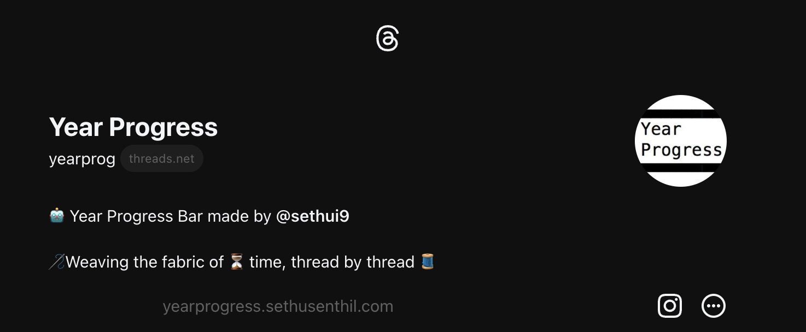

# 🧵 Instagram Threads Year Progress Bot 🤖 ( [@yearprog](https://www.threads.net/@yearprog) )

[Click here to see the bot live on Instagram Threads!](https://www.threads.net/@yearprog)

Instagram Threads is a social media app developed by Instagram (Meta), designed to replicate the functionality of Twitter. It allows users to post text oriented posts. This bot facilitates the dissemination of monthly and yearly progress updates, aiding individuals in effectively monitoring and managing their temporal milestones.

## Technologies Used

- **Node.js**: Node.js is a secure and efficient JavaScript runtime used for executing server-side code in this project. It offers a non-blocking, event-driven architecture and a vast ecosystem of libraries and frameworks for building scalable applications.

- **threads-api**: The `threads-api` package is a library used to interact with the unofficial Threads API. It provides functionalities to post and write threads on Instagram and much more!
  **I am a contributor to this library 🎉**

- **cron**: The `cron` package is used for scheduling tasks at specific intervals. In this project, it is used to schedule the execution of the `getProgress` function to provide regular updates.

- **dotenv**: The `dotenv` package is used to load environment variables from a `.env` file. It helps in managing sensitive information, such as API keys or access tokens.

- **node-telegram-bot-api**: The `node-telegram-bot-api` library is utilized to integrate with the Telegram messaging platform. It enables the bot to send messages and updates to my phone so I can remotely keep track of whats going on.

- **path**: The `path` module from the NodeJS standard library is used to handle file paths and join directories in a platform-independent manner.

## How it Works

The Instagram Threads app is built using Node JS, which serves as the runtime for running the server-side code. The code is responsible for tracking the progress of the current year and month, generating progress bars, and posting updates to the designated chat ID on Telegram.

The `getProgress` function calculates the elapsed time and percentage completed for both the current year and month. It compares these values with the previous post data stored in a JSON file. If there is a difference, it generates a progress bar and posts the update to Telegram using the `postThread` function.

To provide regular updates, the `getProgress` function is initially called immediately, and then scheduled to run at 12:02 AM (midnight) every day using the `cron` function.

## Running the Code

To run the code, perform the following steps:

1. Install NodeJS on your system (if not already installed).
2. Clone the project repository.
3. Set the required environment variables (`TELEGRAM_BOT_TOKEN` and `TELEGRAM_CHAT_ID`) in a `.env` file.
4. Open a terminal or command prompt and navigate to the project directory.
5. Run the command: `npm start`.
